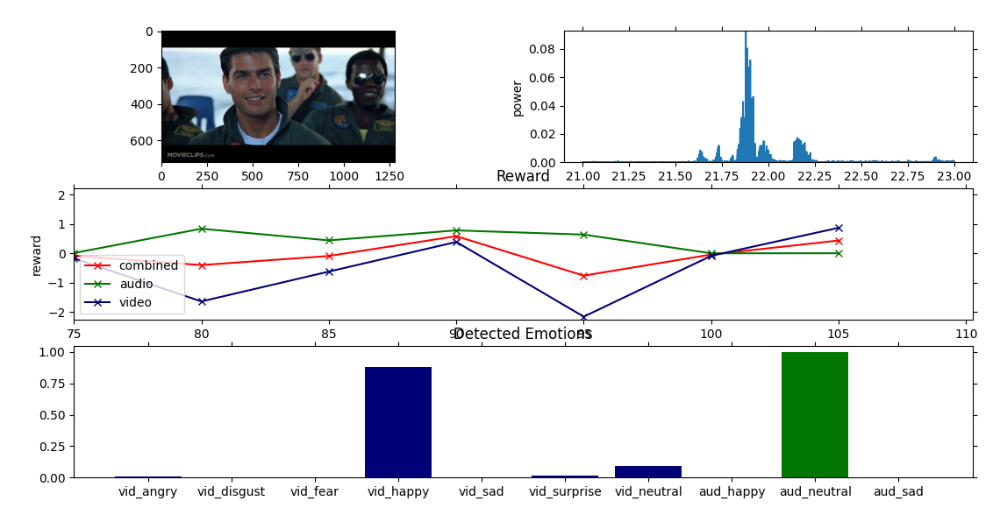

# :robot: Social Reward Function

## Introduction

The intent of this library is to provide a standardised framework and reference implementation for online, dense
recognition and quantification of human emotions through multiple sensor modalities, to form a reward function.

This reward function may then be used for one or both of:
1. Evaluating and comparing the behviour of social robots
2. Performing reinforcement learning in social robotics

For more information, please refer to **(insert citation)**

<i>video credit: https://www.youtube.com/watch?v=wUZxSf_P2r0</i>

## Getting Started

To get started, run:

    git clone --recurse-submodules git@github.com:TomKingsfordUoA/social-reward-function.git
    cd social-reward-function
    sudo ./install_system_dependencies.sh
    pip install .
    srf -h

To change branches and update submodules:

    git checkout <branch>
    git submodule update --init

## Known Limitations

Speech emotion detection is trained using the following datasets:
* [RAVDESS](https://zenodo.org/record/1188976)
* [EMODB](http://emodb.bilderbar.info/docu/)
* [TESS](https://tspace.library.utoronto.ca/handle/1807/24487)

These datasets are collected under relatively sterile laboratory conditions and thus there are understandably
some issues generalizing to realistic situations. We have decided to include these models under the expectation 
that the generation of more realistic datasets will lead to more accurate models in the future.

## Citation

If you use this work, please cite:
	
    @misc{kingsford2022,
      title={A General, Evolution-Inspired Reward Function for Social Robotics}, 
      author={Thomas Kingsford},
      year={2022},
      eprint={2202.00617},
      archivePrefix={arXiv},
      primaryClass={cs.RO}
    }
